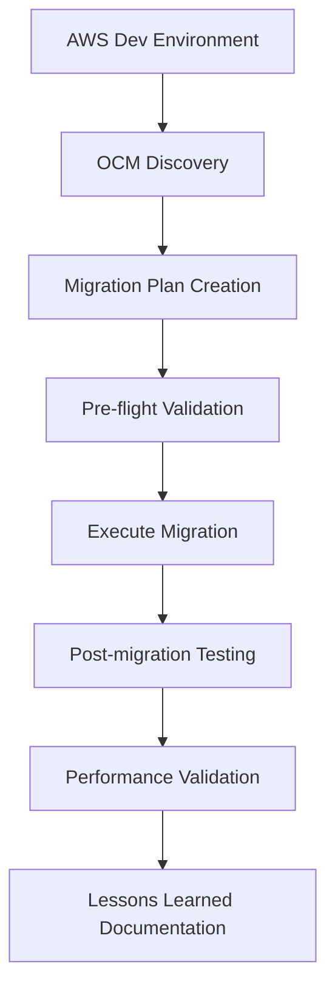

# AWS to OCI Migration - Comprehensive Design & Architecture

**Document Version:** 1.0  
**Date:** August 2025  
**Architect:** Claude (AWS/OCI Migration Expert)  
**Project:** Enterprise Workload Migration from AWS to Oracle Cloud Infrastructure

---

## 📋 Table of Contents

1. [Executive Summary](#executive-summary)
2. [Current State Analysis](#current-state-analysis)
3. [Target State Architecture](#target-state-architecture)
4. [Migration Strategy](#migration-strategy)
5. [Detailed Implementation Phases](#detailed-implementation-phases)
6. [Architecture Diagrams](#architecture-diagrams)
7. [Technical Implementation](#technical-implementation)
8. [Risk Assessment & Mitigation](#risk-assessment--mitigation)
9. [Testing & Validation Strategy](#testing--validation-strategy)
10. [Timeline & Dependencies](#timeline--dependencies)
11. [Success Criteria & KPIs](#success-criteria--kpis)

---

## 🎯 Executive Summary

### **Migration Approach**
**Hybrid Cloud-First Strategy** using Oracle Cloud Migrations (OCM) service for automated discovery, assessment, and migration of AWS workloads to OCI with minimal downtime and business disruption.

### **Key Objectives**
- **Zero Data Loss** during migration
- **Minimize Downtime** (target: <4 hours per application)
- **Cost Optimization** (target: 20-30% reduction)
- **Performance Improvement** (target: 15-25% better performance)
- **Enhanced Security Posture** using OCI native security services

### **Migration Scope**
- **Compute:** EC2 instances → OCI Compute instances
- **Storage:** EBS volumes → OCI Block Volumes
- **Networking:** VPC → VCN with security groups → NSGs
- **Data:** S3 → OCI Object Storage (parallel migration)
- **Databases:** RDS → OCI Database services (if applicable)

---

## 🏗️ Current State Analysis

### **AWS Infrastructure Assessment**

```
┌─────────────────────────────────────────────────────────┐
│                    AWS Current State                     │
├─────────────────────────────────────────────────────────┤
│  Region: us-east-1 (Primary), us-west-2 (DR)           │
│                                                         │
│  ┌─────────────┐  ┌─────────────┐  ┌─────────────┐     │
│  │     VPC     │  │   Route53   │  │     IAM     │     │
│  │ Production  │  │    DNS      │  │   Policies  │     │
│  │             │  │             │  │             │     │
│  └─────────────┘  └─────────────┘  └─────────────┘     │
│                                                         │
│  ┌──────────────────────────────────────────────────┐  │
│  │                EC2 Instances                     │  │
│  │  • Web Servers (t3.medium x 3)                  │  │
│  │  • App Servers (t3.large x 2)                   │  │
│  │  • Database Server (r5.xlarge x 1)              │  │
│  └──────────────────────────────────────────────────┘  │
│                                                         │
│  ┌──────────────────────────────────────────────────┐  │
│  │                 Storage & Data                   │  │
│  │  • EBS gp3 volumes (500GB total)                │  │
│  │  • S3 buckets (2TB data)                        │  │
│  │  • RDS MySQL (if applicable)                    │  │
│  └──────────────────────────────────────────────────┘  │
└─────────────────────────────────────────────────────────┘
```

### **Prerequisites Status: ✅ COMPLETED**
- Oracle Cloud Migrations service activated
- KMS vault and encryption key created
- IAM policies and dynamic groups configured
- Object storage bucket for replication ready
- Tag governance implemented

---

## 🎯 Target State Architecture

### **OCI Target Architecture**

```
┌─────────────────────────────────────────────────────────┐
│                    OCI Target State                      │
├─────────────────────────────────────────────────────────┤
│  Region: us-ashburn-1 (Primary), us-phoenix-1 (DR)     │
│                                                         │
│  ┌─────────────┐  ┌─────────────┐  ┌─────────────┐     │
│  │     VCN     │  │ DNS Zones   │  │     IAM     │     │
│  │ Production  │  │ (Private)   │  │  Policies   │     │
│  │ 10.0.0.0/16 │  │             │  │             │     │
│  └─────────────┘  └─────────────┘  └─────────────┘     │
│                                                         │
│  ┌──────────────────────────────────────────────────┐  │
│  │              Compute Instances                   │  │
│  │  • Web Tier (VM.Standard.E4.Flex x 3)          │  │
│  │  • App Tier (VM.Standard.E4.Flex x 2)          │  │
│  │  • DB Tier (VM.DenseIO2.8 x 1)                 │  │
│  └──────────────────────────────────────────────────┘  │
│                                                         │
│  ┌──────────────────────────────────────────────────┐  │
│  │              Storage & Services                   │  │
│  │  • Block Volumes (Ultra High Performance)       │  │
│  │  • Object Storage (Standard Tier)               │  │
│  │  • OCI Database Service (Optional)              │  │
│  │  • Load Balancer (Application LB)               │  │
│  └──────────────────────────────────────────────────┘  │
└─────────────────────────────────────────────────────────┘
```

### **Key Architecture Improvements**
- **High Performance Computing:** VM.Standard.E4.Flex with flexible OCPU allocation
- **Enhanced Storage:** Ultra High Performance block volumes (>100K IOPS)
- **Advanced Networking:** Fast Connect for hybrid connectivity
- **Native Security:** OCI Security Zones and Cloud Guard
- **Cost Optimization:** Per-second billing and flexible shapes

---

## 🚀 Migration Strategy

### **Migration Methodology: "Wave-Based Parallel Approach"**

```
Migration Strategy Overview
┌─────────────────────────────────────────────────────────┐
│                                                         │
│  Wave 1: Non-Production (Development/Testing)          │
│  ├─ Timeline: Week 1-2                                 │
│  ├─ Risk Level: Low                                    │
│  └─ Validation & Learning                              │
│                                                         │
│  Wave 2: Production - Data Layer                       │
│  ├─ Timeline: Week 3-4                                 │
│  ├─ Risk Level: Medium                                 │
│  └─ Database & Storage Migration                       │
│                                                         │
│  Wave 3: Production - Application Layer                │
│  ├─ Timeline: Week 5-6                                 │
│  ├─ Risk Level: Medium-High                           │
│  └─ Application Servers                                │
│                                                         │
│  Wave 4: Production - Web Layer & DNS                  │
│  ├─ Timeline: Week 7                                   │
│  ├─ Risk Level: High                                   │
│  └─ Final Cutover                                      │
│                                                         │
└─────────────────────────────────────────────────────────┘
```

### **Migration Principles**
1. **Data First:** Migrate data layer before application layer
2. **Parallel Processing:** Run multiple migrations simultaneously where possible
3. **Rollback Ready:** Maintain AWS infrastructure until validation complete
4. **Incremental Validation:** Test each wave thoroughly before proceeding
5. **Business Continuity:** Minimize impact to end users

---

## 📅 Detailed Implementation Phases

### **Phase 1: Discovery & Assessment (Week 1)**

#### **1.1 AWS Environment Discovery**
```bash
# In OCI Console: Migration & Disaster Recovery → Cloud Migrations
1. Asset Sources Configuration
   ├─ Create AWS Asset Source
   ├─ Configure IAM credentials
   ├─ Test connectivity
   └─ Validate region access

2. Discovery Schedule Creation
   ├─ Full environment scan
   ├─ Multi-region discovery
   ├─ Resource inventory
   └─ Dependency mapping
```

**Deliverables:**
- Complete AWS resource inventory
- Cost and performance baseline
- Application dependency map
- Migration complexity assessment

#### **1.2 Target OCI Environment Design**
```bash
# OCI Infrastructure Provisioning
1. Network Foundation
   ├─ VCN creation and subnets
   ├─ Internet Gateway configuration
   ├─ Route tables and security lists
   └─ Network Security Groups (NSGs)

2. Compute Preparation
   ├─ Compute shapes analysis
   ├─ Custom image preparation
   ├─ Instance pool configuration
   └─ Availability domain planning
```

**Deliverables:**
- OCI target architecture design
- Network configuration plan
- Compute sizing recommendations
- Security configuration blueprint

### **Phase 2: Pilot Migration (Week 2)**

#### **2.1 Non-Production Migration**


**Implementation Steps:**
1. **Create Migration Project**
   - OCI Console → Cloud Migrations → Migration Projects
   - Configure source and target environments
   - Define migration strategy parameters

2. **Migration Plan Development**
   - Automated dependency analysis
   - Resource mapping configuration
   - Network translation rules
   - Storage optimization settings

3. **Execute Pilot Migration**
   - Launch migration workflows
   - Monitor progress and performance
   - Handle error conditions
   - Validate successful completion

**Success Criteria:**
- 100% resource discovery accuracy
- Migration completed within 2-hour window
- All services functional post-migration
- Performance meets or exceeds baseline

#### **2.2 Validation & Optimization**
- **Functionality Testing:** End-to-end application testing
- **Performance Testing:** Load testing and benchmarking
- **Security Testing:** Security posture validation
- **Process Refinement:** Update procedures based on lessons learned

### **Phase 3: Data Layer Migration (Week 3-4)**

#### **3.1 Database Migration Strategy**

```
Database Migration Approach
┌─────────────────────────────────────────────────────────┐
│                                                         │
│  Option A: Lift & Shift (Recommended for MySQL)        │
│  ├─ RDS MySQL → OCI Compute + MySQL                   │
│  ├─ Data migration via OCM replication                 │
│  └─ Minimal application changes                        │
│                                                         │
│  Option B: Database Service Migration                   │
│  ├─ RDS MySQL → OCI MySQL Database Service            │
│  ├─ Schema and data migration tools                    │
│  └─ Enhanced performance and management                │
│                                                         │
└─────────────────────────────────────────────────────────┘
```

**Implementation:**
1. **Pre-Migration Data Sync**
   - Establish real-time replication
   - Monitor replication lag
   - Validate data consistency

2. **Database Cutover Process**
   - Application maintenance window
   - Final data synchronization
   - Connection string updates
   - Application restart and validation

#### **3.2 Storage Migration**
```bash
# EBS to OCI Block Volume Migration
1. Volume Snapshot Creation
   ├─ Create consistent snapshots
   ├─ Copy to OCM replication bucket
   └─ Verify snapshot integrity

2. Block Volume Provisioning
   ├─ High Performance SSD volumes
   ├─ Appropriate IOPS allocation
   └─ Backup policy configuration

3. Data Migration & Validation
   ├─ Parallel data transfer
   ├─ Checksum verification
   └─ Performance testing
```

### **Phase 4: Application Layer Migration (Week 5-6)**

#### **4.1 Application Server Migration**
```yaml
Migration Configuration:
  Source:
    - AWS EC2 t3.large instances
    - Application runtime environment
    - Configuration and dependencies
  
  Target:
    - OCI VM.Standard.E4.Flex
    - Optimized OCPU/memory allocation
    - Enhanced performance characteristics
  
  Process:
    - Live migration with minimal downtime
    - Application configuration updates
    - Service startup and health checks
```

#### **4.2 Network Integration**
- **Load Balancer Configuration:** OCI Application Load Balancer setup
- **DNS Updates:** Gradual DNS migration strategy
- **Security Groups → NSGs:** Convert AWS security groups to OCI NSGs
- **VPC Peering → DRG:** Implement Dynamic Routing Gateway for hybrid connectivity

### **Phase 5: Web Layer & Final Cutover (Week 7)**

#### **5.1 Web Tier Migration**
- **Frontend Servers:** Web server migration and optimization
- **CDN Integration:** OCI Edge services configuration
- **SSL Certificate:** Certificate migration and validation

#### **5.2 DNS Cutover Strategy**
```
DNS Cutover Process (Blue-Green Approach)
┌─────────────────────────────────────────────────────────┐
│                                                         │
│  Step 1: Parallel Environment (Blue-Green)             │
│  ├─ AWS Environment (Blue) - Current Production        │
│  ├─ OCI Environment (Green) - New Target               │
│  └─ Load balancer distributes traffic                  │
│                                                         │
│  Step 2: Gradual Traffic Shift                         │
│  ├─ 10% traffic to OCI (validation)                   │
│  ├─ 50% traffic to OCI (performance testing)          │
│  ├─ 90% traffic to OCI (final validation)             │
│  └─ 100% traffic to OCI (complete cutover)            │
│                                                         │
└─────────────────────────────────────────────────────────┘
```

---

## 🔧 Technical Implementation Details

### **Oracle Cloud Migrations Configuration**

#### **Asset Source Configuration**
```json
{
  "assetSource": {
    "type": "AWS",
    "displayName": "AWS-Production-Environment",
    "compartmentId": "ocid1.compartment.oc1..aaaaaaaa...",
    "awsConfiguration": {
      "authenticationType": "IAM_USER",
      "accessKeyId": "${var.aws_access_key}",
      "secretAccessKey": "${var.aws_secret_key}",
      "region": "us-east-1",
      "crossAccountRoleArn": "arn:aws:iam::123456789012:role/OCIMigrationRole"
    }
  }
}
```

#### **Migration Project Configuration**
```yaml
migrationProject:
  displayName: "AWS-to-OCI-Production-Migration"
  compartmentId: "ocid1.compartment.oc1..aaaaaaaa..."
  
  replicationSchedule:
    executionRecurrenceDetails: "DAILY"
    timeNextExecution: "2025-08-25T02:00:00Z"
  
  migrationStrategies:
    - resourceType: "EC2_INSTANCE"
      strategy: "LIFT_AND_SHIFT"
      targetCompartment: "ocid1.compartment.oc1..aaaaaaaa..."
      
    - resourceType: "EBS_VOLUME" 
      strategy: "LIFT_AND_SHIFT_WITH_OPTIMIZATION"
      performanceOptimization: true
```

### **Network Configuration**

#### **VCN Setup (Terraform)**
```hcl
# Primary VCN Configuration
resource "oci_core_vcn" "migration_vcn" {
  compartment_id = var.compartment_ocid
  display_name   = "migration-production-vcn"
  cidr_blocks    = ["10.0.0.0/16"]
  dns_label      = "migrationvcn"
  
  defined_tags = local.migration_tags
}

# Public Subnet (Web Tier)
resource "oci_core_subnet" "web_subnet" {
  compartment_id = var.compartment_ocid
  vcn_id         = oci_core_vcn.migration_vcn.id
  display_name   = "web-tier-subnet"
  cidr_block     = "10.0.1.0/24"
  dns_label      = "webtier"
  
  route_table_id    = oci_core_route_table.public_rt.id
  security_list_ids = [oci_core_security_list.web_security_list.id]
}

# Private Subnet (Application Tier)
resource "oci_core_subnet" "app_subnet" {
  compartment_id        = var.compartment_ocid
  vcn_id                = oci_core_vcn.migration_vcn.id
  display_name          = "app-tier-subnet"
  cidr_block            = "10.0.2.0/24"
  dns_label             = "apptier"
  prohibit_public_ip_on_vnic = true
  
  route_table_id    = oci_core_route_table.private_rt.id
  security_list_ids = [oci_core_security_list.app_security_list.id]
}

# Database Subnet
resource "oci_core_subnet" "db_subnet" {
  compartment_id        = var.compartment_ocid
  vcn_id                = oci_core_vcn.migration_vcn.id
  display_name          = "database-tier-subnet"
  cidr_block            = "10.0.3.0/24"
  dns_label             = "dbtier"
  prohibit_public_ip_on_vnic = true
  
  route_table_id    = oci_core_route_table.private_rt.id
  security_list_ids = [oci_core_security_list.db_security_list.id]
}
```

#### **Network Security Groups (NSGs)**
```hcl
# Web Tier NSG
resource "oci_core_network_security_group" "web_nsg" {
  compartment_id = var.compartment_ocid
  vcn_id         = oci_core_vcn.migration_vcn.id
  display_name   = "web-tier-nsg"
}

resource "oci_core_network_security_group_security_rule" "web_ingress_http" {
  network_security_group_id = oci_core_network_security_group.web_nsg.id
  direction                 = "INGRESS"
  protocol                  = "6" # TCP
  
  source      = "0.0.0.0/0"
  source_type = "CIDR_BLOCK"
  
  tcp_options {
    destination_port_range {
      min = 80
      max = 80
    }
  }
}

resource "oci_core_network_security_group_security_rule" "web_ingress_https" {
  network_security_group_id = oci_core_network_security_group.web_nsg.id
  direction                 = "INGRESS"
  protocol                  = "6" # TCP
  
  source      = "0.0.0.0/0"
  source_type = "CIDR_BLOCK"
  
  tcp_options {
    destination_port_range {
      min = 443
      max = 443
    }
  }
}

# Application Tier NSG
resource "oci_core_network_security_group" "app_nsg" {
  compartment_id = var.compartment_ocid
  vcn_id         = oci_core_vcn.migration_vcn.id
  display_name   = "app-tier-nsg"
}

resource "oci_core_network_security_group_security_rule" "app_ingress_from_web" {
  network_security_group_id = oci_core_network_security_group.app_nsg.id
  direction                 = "INGRESS"
  protocol                  = "6" # TCP
  
  source      = oci_core_network_security_group.web_nsg.id
  source_type = "NETWORK_SECURITY_GROUP"
  
  tcp_options {
    destination_port_range {
      min = 8080
      max = 8080
    }
  }
}
```

### **Compute Instance Configuration**

#### **Web Tier Instances**
```hcl
resource "oci_core_instance" "web_servers" {
  count               = 3
  compartment_id      = var.compartment_ocid
  availability_domain = data.oci_identity_availability_domains.ads.availability_domains[count.index % length(data.oci_identity_availability_domains.ads.availability_domains)].name
  display_name        = "web-server-${count.index + 1}"
  
  shape = "VM.Standard.E4.Flex"
  shape_config {
    ocpus         = 2
    memory_in_gbs = 16
  }
  
  create_vnic_details {
    subnet_id              = oci_core_subnet.web_subnet.id
    display_name           = "web-server-${count.index + 1}-vnic"
    assign_public_ip       = true
    nsg_ids                = [oci_core_network_security_group.web_nsg.id]
    skip_source_dest_check = false
  }
  
  source_details {
    source_type = "image"
    source_id   = var.web_server_image_ocid # Custom migrated image
  }
  
  metadata = {
    ssh_authorized_keys = var.ssh_public_key
    user_data = base64encode(templatefile("${path.module}/cloud-init/web-server.yaml", {
      server_index = count.index + 1
    }))
  }
  
  defined_tags = merge(local.migration_tags, {
    "Application.Tier" = "Web"
    "Migration.Source" = "AWS-EC2"
  })
}
```

#### **Application Tier Instances**
```hcl
resource "oci_core_instance" "app_servers" {
  count               = 2
  compartment_id      = var.compartment_ocid
  availability_domain = data.oci_identity_availability_domains.ads.availability_domains[count.index % length(data.oci_identity_availability_domains.ads.availability_domains)].name
  display_name        = "app-server-${count.index + 1}"
  
  shape = "VM.Standard.E4.Flex"
  shape_config {
    ocpus         = 4
    memory_in_gbs = 32
  }
  
  create_vnic_details {
    subnet_id              = oci_core_subnet.app_subnet.id
    display_name           = "app-server-${count.index + 1}-vnic"
    assign_public_ip       = false
    nsg_ids                = [oci_core_network_security_group.app_nsg.id]
    skip_source_dest_check = false
  }
  
  source_details {
    source_type = "image"
    source_id   = var.app_server_image_ocid # Custom migrated image
  }
  
  metadata = {
    ssh_authorized_keys = var.ssh_public_key
    user_data = base64encode(templatefile("${path.module}/cloud-init/app-server.yaml", {
      server_index = count.index + 1
      db_connection_string = var.database_connection_string
    }))
  }
  
  defined_tags = merge(local.migration_tags, {
    "Application.Tier" = "Application"
    "Migration.Source" = "AWS-EC2"
  })
}
```

#### **Database Instance**
```hcl
resource "oci_core_instance" "database_server" {
  compartment_id      = var.compartment_ocid
  availability_domain = data.oci_identity_availability_domains.ads.availability_domains[0].name
  display_name        = "database-server"
  
  shape = "VM.DenseIO2.8"  # High performance for database workloads
  
  create_vnic_details {
    subnet_id              = oci_core_subnet.db_subnet.id
    display_name           = "database-server-vnic"
    assign_public_ip       = false
    nsg_ids                = [oci_core_network_security_group.db_nsg.id]
    skip_source_dest_check = false
  }
  
  source_details {
    source_type = "image"
    source_id   = var.database_image_ocid # Custom migrated image
  }
  
  metadata = {
    ssh_authorized_keys = var.ssh_public_key
    user_data = base64encode(templatefile("${path.module}/cloud-init/database-server.yaml", {
      mysql_root_password = var.mysql_root_password
    }))
  }
  
  defined_tags = merge(local.migration_tags, {
    "Application.Tier" = "Database"
    "Migration.Source" = "AWS-EC2"
  })
}
```

---

## ⚠️ Risk Assessment & Mitigation

### **High-Risk Areas**

#### **1. Data Integrity Risk**
```
Risk: Data corruption or loss during migration
Probability: Medium | Impact: Critical

Mitigation Strategies:
├─ Multiple backup copies before migration
├─ Real-time data validation during transfer
├─ Checksum verification at block level
├─ Point-in-time recovery capabilities
└─ Rollback procedures with data consistency
```

#### **2. Application Downtime Risk**
```
Risk: Extended downtime during cutover
Probability: Medium | Impact: High

Mitigation Strategies:
├─ Blue-green deployment approach
├─ Load balancer traffic shifting
├─ Rollback automation within 15 minutes
├─ Maintenance window during low usage
└─ Communication plan for stakeholders
```

#### **3. Performance Degradation Risk**
```
Risk: Applications perform worse on OCI initially
Probability: Low | Impact: Medium

Mitigation Strategies:
├─ Performance testing in pilot phase
├─ Right-sizing analysis and optimization
├─ Performance monitoring and alerting
├─ Quick performance tuning procedures
└─ Gradual traffic increase methodology
```

#### **4. Network Connectivity Risk**
```
Risk: Network issues preventing proper communication
Probability: Low | Impact: High

Mitigation Strategies:
├─ Comprehensive network testing
├─ Multiple connectivity paths
├─ Network monitoring and diagnostics
├─ Emergency connectivity procedures
└─ DNS failback mechanisms
```

### **Risk Mitigation Timeline**
```
Pre-Migration (2 weeks before)
├─ Complete backup of all systems
├─ Network connectivity validation
├─ Performance baseline establishment
└─ Rollback procedure testing

During Migration
├─ Real-time monitoring dashboards
├─ Issue escalation procedures
├─ Technical team on standby 24/7
└─ Automated rollback triggers

Post-Migration (2 weeks after)
├─ Intensive monitoring and alerting
├─ Performance optimization
├─ User feedback collection
└─ Lessons learned documentation
```

---

## 🧪 Testing & Validation Strategy

### **Testing Methodology: "Progressive Validation Approach"**

#### **Phase 1: Infrastructure Testing**
```yaml
Infrastructure Validation:
  Network Connectivity:
    - ICMP ping tests between all tiers
    - Port connectivity validation
    - DNS resolution testing
    - Load balancer health checks
  
  Compute Performance:
    - CPU utilization baselines
    - Memory consumption patterns
    - Disk I/O performance testing
    - Network throughput validation
  
  Storage Performance:
    - IOPS testing (read/write)
    - Throughput measurements
    - Latency benchmarking
    - Backup/restore testing
```

#### **Phase 2: Application Testing**
```yaml
Application Validation:
  Functional Testing:
    - End-to-end user workflows
    - API endpoint testing
    - Database connectivity
    - File upload/download operations
  
  Integration Testing:
    - Service-to-service communication
    - External API integrations
    - Third-party service connections
    - Authentication systems
  
  Performance Testing:
    - Load testing (normal capacity)
    - Stress testing (150% capacity)
    - Spike testing (sudden traffic bursts)
    - Endurance testing (24-hour runs)
```

#### **Phase 3: Security Testing**
```yaml
Security Validation:
  Access Control:
    - User authentication testing
    - Role-based access control
    - API security validation
    - Network access restrictions
  
  Data Protection:
    - Encryption at rest verification
    - Encryption in transit testing
    - Data backup integrity
    - Compliance requirement checks
  
  Vulnerability Assessment:
    - Security scanning tools
    - Penetration testing
    - Configuration reviews
    - Patch level validation
```

### **Automated Testing Framework**

#### **Continuous Testing Pipeline**
```bash
#!/bin/bash
# Migration Testing Automation Script

# Phase 1: Infrastructure Tests
echo "Starting Infrastructure Validation..."
./tests/network-connectivity-test.sh
./tests/compute-performance-test.sh
./tests/storage-performance-test.sh

# Phase 2: Application Tests  
echo "Starting Application Validation..."
./tests/functional-test-suite.sh
./tests/integration-test-suite.sh
./tests/performance-load-test.sh

# Phase 3: Security Tests
echo "Starting Security Validation..."
./tests/access-control-test.sh
./tests/data-encryption-test.sh
./tests/vulnerability-scan.sh

# Generate Test Report
./generate-test-report.sh
```

---

## ⏰ Timeline & Dependencies

### **Master Project Timeline**

```
Migration Project Timeline (7 Weeks)
┌─────────────────────────────────────────────────────────┐
│                                                         │
│ Week 1: Discovery & Assessment                         │
│ ├─ AWS environment discovery                           │
│ ├─ Resource inventory and analysis                     │
│ ├─ OCI target environment design                       │
│ └─ Migration planning finalization                     │
│                                                         │
│ Week 2: Pilot Migration (Non-Production)               │
│ ├─ Dev/Test environment migration                      │
│ ├─ Process validation and optimization                 │
│ ├─ Team training and procedure refinement              │
│ └─ Go/No-Go decision for production                    │
│                                                         │
│ Week 3-4: Data Layer Migration                         │
│ ├─ Database migration and validation                   │
│ ├─ Storage migration and optimization                  │
│ ├─ Data integrity verification                         │
│ └─ Performance baseline establishment                  │
│                                                         │
│ Week 5-6: Application Layer Migration                  │
│ ├─ Application server migration                        │
│ ├─ Service integration and testing                     │
│ ├─ Performance tuning and optimization                 │
│ └─ End-to-end functionality validation                 │
│                                                         │
│ Week 7: Web Layer & Final Cutover                      │
│ ├─ Web server migration                                │
│ ├─ DNS cutover and traffic routing                     │
│ ├─ Final validation and optimization                   │
│ └─ Project closure and documentation                   │
│                                                         │
└─────────────────────────────────────────────────────────┘
```

### **Critical Path Dependencies**
```
Critical Dependencies:
├─ AWS IAM policy configuration (prerequisite)
├─ OCI network infrastructure (Week 1 dependency)
├─ Data migration completion (Week 3-4 dependency)
├─ Application testing validation (Week 5-6 dependency)
└─ DNS provider coordination (Week 7 dependency)

Parallel Activities:
├─ OCI infrastructure provisioning (parallel with discovery)
├─ Application configuration updates (parallel with migration)
├─ Security testing (parallel with functional testing)
└─ Documentation updates (continuous throughout project)
```

### **Resource Allocation Plan**
```yaml
Team Structure:
  Project Manager: 1 FTE (full project duration)
  Migration Architect: 1 FTE (full project duration) 
  Infrastructure Engineer: 2 FTE (Week 1-6)
  Application Engineer: 2 FTE (Week 2-7)
  Database Administrator: 1 FTE (Week 3-5)
  Network Engineer: 1 FTE (Week 1, 7)
  Security Engineer: 1 FTE (Week 2, 4, 6)
  Testing Engineer: 2 FTE (Week 2-7)

Total Effort: ~70 person-days over 7 weeks
```

---

## 🎯 Success Criteria & KPIs

### **Migration Success Metrics**

#### **Technical KPIs**
```yaml
Performance Metrics:
  Application Response Time:
    Target: ≤ Current baseline + 10%
    Critical: ≤ Current baseline + 25%
  
  System Availability:
    Target: 99.9% uptime during migration
    Critical: 99.5% uptime during migration
  
  Data Integrity:
    Target: 100% data accuracy
    Critical: Zero data loss tolerance
  
  Migration Duration:
    Target: Each wave completes within scheduled window
    Critical: No wave exceeds 2x planned duration
```

#### **Business KPIs**
```yaml
Business Impact Metrics:
  User Experience:
    Target: Zero user-reported issues
    Critical: < 5 user-reported issues per day
  
  Business Continuity:
    Target: Zero business process interruption
    Critical: < 4 hours total downtime
  
  Cost Optimization:
    Target: 20-30% cost reduction within 3 months
    Acceptable: 15% cost reduction within 6 months
  
  Security Posture:
    Target: Maintain or improve security rating
    Critical: No security vulnerabilities introduced
```

### **Quality Gates**
```
Migration Quality Gates:
├─ Phase 1 Gate: Discovery completeness (95%+ accuracy)
├─ Phase 2 Gate: Pilot migration success (zero critical issues)
├─ Phase 3 Gate: Data integrity validation (100% accuracy)
├─ Phase 4 Gate: Application functionality (all tests pass)
└─ Phase 5 Gate: Production readiness (all KPIs green)

Go/No-Go Criteria:
├─ All automated tests pass
├─ Performance meets acceptance criteria
├─ Security validation complete
├─ Rollback procedures verified
└─ Business stakeholder approval
```

### **Post-Migration Optimization**
```
30-Day Optimization Plan:
Week 1-2: Intensive Monitoring
├─ Performance tuning and optimization
├─ Cost analysis and right-sizing
├─ Security posture enhancement
└─ User feedback collection

Week 3-4: Fine-tuning
├─ Application configuration optimization
├─ Database performance tuning
├─ Network optimization
└─ Backup and disaster recovery testing

Post-30 Days: Continuous Improvement
├─ Monthly performance reviews
├─ Quarterly cost optimization
├─ Security updates and patches
└─ Disaster recovery testing
```

---

## 📊 Architecture Diagrams

### **Overall Migration Architecture**

```
┌─────────────────────────────────────────────────────────────────────────────────┐
│                           Migration Architecture Overview                        │
├─────────────────────────────────────────────────────────────────────────────────┤
│                                                                                 │
│  ┌─────────────────┐                                    ┌─────────────────┐      │
│  │      AWS        │ ◄──── Migration Data Flow ────► │      OCI        │      │
│  │   Source Env    │                                    │   Target Env    │      │
│  └─────────────────┘                                    └─────────────────┘      │
│                                                                                 │
│  ┌─────────────────┐                                    ┌─────────────────┐      │
│  │  EC2 Instances  │                                    │ Compute Instances│      │
│  │  ├─ Web (x3)   │ ────────── OCM Migration ────────► │ ├─ Web (x3)     │      │
│  │  ├─ App (x2)   │                                    │ ├─ App (x2)     │      │
│  │  └─ DB (x1)    │                                    │ └─ DB (x1)      │      │
│  └─────────────────┘                                    └─────────────────┘      │
│                                                                                 │
│  ┌─────────────────┐                                    ┌─────────────────┐      │
│  │ EBS Volumes     │                                    │ Block Volumes   │      │
│  │ ├─ gp3 500GB   │ ────── Replication & Sync ──────► │ ├─ UHP 500GB    │      │
│  │ └─ Snapshots   │                                    │ └─ Backups      │      │
│  └─────────────────┘                                    └─────────────────┘      │
│                                                                                 │
│  ┌─────────────────┐                                    ┌─────────────────┐      │
│  │ VPC Network     │                                    │ VCN Network     │      │
│  │ ├─ Subnets     │ ────── Network Translation ──────► │ ├─ Subnets      │      │
│  │ ├─ Sec Groups │                                    │ ├─ NSGs         │      │
│  │ └─ NACLs       │                                    │ └─ Security Lists│      │
│  └─────────────────┘                                    └─────────────────┘      │
│                                                                                 │
└─────────────────────────────────────────────────────────────────────────────────┘
```

### **Network Architecture Comparison**

```
AWS Network Architecture                    OCI Network Architecture
┌─────────────────────────┐                ┌─────────────────────────┐
│       VPC (AWS)         │                │       VCN (OCI)         │
│    172.31.0.0/16        │   ═══════════► │     10.0.0.0/16         │
├─────────────────────────┤                ├─────────────────────────┤
│                         │                │                         │
│ Public Subnet           │                │ Public Subnet           │
│ 172.31.1.0/24          │                │ 10.0.1.0/24            │
│ ├─ Web Servers (x3)    │                │ ├─ Web Servers (x3)    │
│ └─ Internet Gateway     │                │ └─ Internet Gateway     │
│                         │                │                         │
│ Private Subnet          │                │ Private Subnet          │
│ 172.31.2.0/24          │                │ 10.0.2.0/24            │
│ ├─ App Servers (x2)    │                │ ├─ App Servers (x2)    │
│ └─ NAT Gateway          │                │ └─ NAT Gateway          │
│                         │                │                         │
│ Database Subnet         │                │ Database Subnet         │
│ 172.31.3.0/24          │                │ 10.0.3.0/24            │
│ ├─ DB Server (x1)      │                │ ├─ DB Server (x1)      │
│ └─ No Internet Access  │                │ └─ No Internet Access  │
│                         │                │                         │
└─────────────────────────┘                └─────────────────────────┘
```

### **Migration Data Flow**

```
┌─────────────────────────────────────────────────────────────────────────────────┐
│                            Data Migration Flow                                   │
├─────────────────────────────────────────────────────────────────────────────────┤
│                                                                                 │
│ Phase 1: Discovery                                                              │
│ ┌─────────────┐    ┌──────────────┐    ┌─────────────────┐                     │
│ │ AWS Resources│ ──►│ OCM Discovery│ ──►│ Inventory       │                     │
│ │             │    │ Service      │    │ Database        │                     │
│ └─────────────┘    └──────────────┘    └─────────────────┘                     │
│                                                                                 │
│ Phase 2: Replication                                                            │
│ ┌─────────────┐    ┌──────────────┐    ┌─────────────────┐                     │
│ │ EBS Snapshots│ ──►│ Replication  │ ──►│ OCI Object      │                     │
│ │             │    │ Service      │    │ Storage         │                     │
│ └─────────────┘    └──────────────┘    └─────────────────┘                     │
│                            │                     │                             │
│                            ▼                     ▼                             │
│ Phase 3: Migration         │           ┌─────────────────┐                     │
│ ┌─────────────┐            │           │ OCI Block       │                     │
│ │ EC2 Instance│ ───────────────────────►│ Volumes         │                     │
│ │ Images      │                        │                 │                     │
│ └─────────────┘                        └─────────────────┘                     │
│                                                  │                             │
│                                                  ▼                             │
│ Phase 4: Provisioning                 ┌─────────────────┐                     │
│                                        │ OCI Compute     │                     │
│                                        │ Instances       │                     │
│                                        └─────────────────┘                     │
│                                                                                 │
└─────────────────────────────────────────────────────────────────────────────────┘
```

---

## 📝 Implementation Checklist

### **Pre-Migration Checklist**
```
□ OCI Prerequisites Completed
  ├─ □ OCM service activated and configured
  ├─ □ KMS vault and encryption key ready
  ├─ □ IAM policies and dynamic groups created
  ├─ □ Object storage bucket provisioned
  └─ □ Network infrastructure planned

□ AWS Environment Prepared
  ├─ □ IAM policies created and attached
  ├─ □ Cross-account role configured (if applicable)
  ├─ □ Resource inventory documented
  ├─ □ Performance baselines established
  └─ □ Backup procedures verified

□ Team Readiness
  ├─ □ Migration team trained on OCM
  ├─ □ Roles and responsibilities defined
  ├─ □ Communication plan established
  ├─ □ Escalation procedures documented
  └─ □ Rollback procedures tested

□ Business Readiness
  ├─ □ Stakeholder approval obtained
  ├─ □ Maintenance windows scheduled
  ├─ □ User communication plan active
  ├─ □ Change management process followed
  └─ □ Go/No-Go criteria defined
```

### **Migration Execution Checklist**
```
□ Phase 1: Discovery
  ├─ □ Asset source connectivity validated
  ├─ □ Full environment discovery completed
  ├─ □ Resource dependencies mapped
  ├─ □ Migration complexity assessed
  └─ □ Target architecture finalized

□ Phase 2: Pilot Migration
  ├─ □ Non-production environment migrated
  ├─ □ All functionality tested and validated
  ├─ □ Performance benchmarks met
  ├─ □ Lessons learned documented
  └─ □ Go/No-Go decision made

□ Phase 3: Data Migration
  ├─ □ Database migration completed successfully
  ├─ □ Data integrity verified (100% accuracy)
  ├─ □ Storage migration and optimization done
  ├─ □ Backup and recovery tested
  └─ □ Performance baselines established

□ Phase 4: Application Migration
  ├─ □ Application servers migrated
  ├─ □ Service integrations validated
  ├─ □ End-to-end testing completed
  ├─ □ Performance tuning applied
  └─ □ Security validation passed

□ Phase 5: Final Cutover
  ├─ □ Web servers migrated successfully
  ├─ □ Load balancer configured and tested
  ├─ □ DNS cutover executed
  ├─ □ All services operational
  └─ □ Monitoring and alerting active
```

### **Post-Migration Checklist**
```
□ Immediate Post-Migration (24 hours)
  ├─ □ All systems operational and stable
  ├─ □ Performance monitoring active
  ├─ □ User access validated
  ├─ □ Critical business processes tested
  └─ □ Incident response team on standby

□ Short-term Validation (1 week)
  ├─ □ Full application functionality verified
  ├─ □ Performance optimization completed
  ├─ □ Security posture assessed
  ├─ □ Cost analysis initiated
  └─ □ User feedback collected

□ Long-term Optimization (1 month)
  ├─ □ Performance tuning completed
  ├─ □ Cost optimization implemented
  ├─ □ Disaster recovery tested
  ├─ □ Documentation finalized
  └─ □ Knowledge transfer completed

□ Project Closure
  ├─ □ All success criteria met
  ├─ □ Final project report completed
  ├─ □ Lessons learned documented
  ├─ □ Team recognition and feedback
  └─ □ AWS resources decommissioned
```

---

## 📞 Support & Escalation

### **Support Structure**
```
Migration Support Hierarchy
┌─────────────────────────────────────────────────────────┐
│                                                         │
│ Level 1: Migration Team (24/7 during migration)        │
│ ├─ First response to issues                            │
│ ├─ Standard troubleshooting procedures                 │
│ └─ Escalation within 30 minutes                       │
│                                                         │
│ Level 2: Technical Specialists                         │
│ ├─ Complex technical issue resolution                  │
│ ├─ Performance optimization                            │
│ └─ Architecture adjustments                            │
│                                                         │
│ Level 3: Vendor Support (Oracle & AWS)                 │
│ ├─ Platform-specific issues                           │
│ ├─ Service escalations                                │
│ └─ Critical issue resolution                          │
│                                                         │
│ Level 4: Executive Escalation                          │
│ ├─ Business-critical decisions                        │
│ ├─ Go/No-Go determinations                           │
│ └─ Strategic direction changes                         │
│                                                         │
└─────────────────────────────────────────────────────────┘
```

### **Emergency Procedures**
```yaml
Critical Issue Response:
  Severity 1 (System Down):
    Response Time: 15 minutes
    Escalation Path: Technical Lead → Migration Manager → CTO
    Rollback Authority: Migration Manager or higher
    Communication: All stakeholders within 30 minutes
  
  Severity 2 (Performance Degradation):
    Response Time: 1 hour
    Escalation Path: Technical Specialist → Technical Lead
    Resolution Target: 4 hours
    Communication: Business stakeholders within 2 hours
  
  Severity 3 (Minor Issues):
    Response Time: 4 hours
    Escalation Path: Standard support procedures
    Resolution Target: 24 hours
    Communication: Next scheduled status update
```

---

**🎯 Ready for Migration Execution!**

This comprehensive design provides the complete roadmap for your AWS to OCI migration. The foundation is solid with all prerequisites completed, and the detailed implementation plan ensures a successful migration with minimal risk and maximum business benefit.

**Next Step:** Execute Phase 1 - Discovery & Assessment to begin the migration journey! 🚀